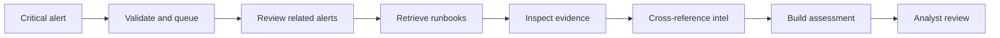

# AI Standardization Matrix

A build standard for **how you should design and ship AI automation** — agents, RAG loops, MCP tools, and orchestration that stay inspectable, scoped, and reviewable.

This is not a hiring deck, compliance certificate, or product pitch. It is an engineering bar: twelve controls, four maturity levels, and verification signals to apply while you build.

## Interactive example

Walk a SIEM alert-response path and see which controls apply at each hop:

**https://notoriouspog.github.io/ai-standardization-matrix/**

## Example: SIEM alert → AI-assisted response

The matrix is the build standard. The interactive example is the same SIEM investigation walkthrough used in the architecture lab: a critical detection-queue alert moves through Zod validation, Wazuh MCP, scoped RAG, evidence tools, intelligence, a cited assessment, and analyst review.

**Rule of the example:** the AI gathers and drafts. It does not auto-contain the host. A person decides.

| Stage | What happens | Matrix controls |
| --- | --- | --- |
| Critical alert | Detection-queue arrival for FILESVR-01 ransom note | C01, C11 |
| Validate & queue | Zod envelope + durable investigation job | C01, C02 |
| Review related alerts | Scoped Wazuh MCP tool calls | C03, C04, C08 |
| Retrieve runbooks | Approved tenant RAG with versioned citations | C05 |
| Inspect evidence | osquery / YARA / inventory / DNS / proxy checks | C04, C06 |
| Cross-reference intelligence | MISP + source lookups + OSV exposure | C04, C06, C07 |
| Build assessment | Cited brief with facts, hypotheses, owners | C06, C07, C08 |
| Analyst review | Inbox handoff; review ≠ containment | C09, C10, C12 |

Same control bar applies to CRM agents, cost bots, or MCP ops assistants. SIEM is the concrete incident-shaped example.

## Quick start

1. Skim the [SIEM flow example](https://notoriouspog.github.io/ai-standardization-matrix/)
2. Read [MATRIX.md](MATRIX.md) — twelve domains × L0–L3
3. Score your system with [templates/scorecard.md](templates/scorecard.md)
4. Use [CHECKLIST.md](CHECKLIST.md) in design and PR review
5. Import [data/matrix.json](data/matrix.json) for machine-readable gates

**Production bar:** every control at **Standard (L2)** or higher. **Hardened (L3)** when the system can change state, spend money, or touch production security systems.

## The twelve domains

| ID | Domain | One-line rule |
| --- | --- | --- |
| C01 | Ingress & schema | Validate untrusted input with strict schemas before the model sees it |
| C02 | Scope & tenancy | Bind work to tenant, time, and entity scope; reject out-of-scope data |
| C03 | Auth & identity | Authority comes from the authenticated session, never from model text |
| C04 | Tool contracts | Allowlist tools; validate arguments and results; no open shell/HTTP by default |
| C05 | Retrieval & RAG | Search approved corpora only; cite only what this run retrieved |
| C06 | Evidence integrity | Findings must reference known evidence/entity IDs; invent nothing |
| C07 | Reasoning hygiene | Separate facts, hypotheses, alternatives, and missing evidence |
| C08 | Agent bounds | Cap turns, tools, repairs, and wall time; stop identical loops |
| C09 | Human control | Default action is a reviewable draft; high-impact acts need a person |
| C10 | Memory | Explicit save only; label untrusted; isolate by tenant; cap retention |
| C11 | Secrets & data hygiene | No credentials in repos, exports, or browser storage of provider keys |
| C12 | Evaluation & honesty | Test citations, tools, and negatives; label fixtures vs production; state limits |

## Maturity levels

| Level | Name | Meaning |
| --- | --- | --- |
| L0 | Absent | Control missing or easily bypassed |
| L1 | Basic | Present for the happy path |
| L2 | Standard | Enforced in code, with tests or evals |
| L3 | Hardened | Production-grade: authz, budgets, audit, negative controls, repair limits |

See [ADOPTION.md](ADOPTION.md) for rollout by project stage.

## How to use this when building

- **Design:** set L2 as the acceptance bar before writing the agent loop
- **Implementation:** ship validators and budgets in the same PR as the first tool call
- **PR review:** attach the checklist; block merge on C01–C08 + C11 at L2 for any live loop
- **Release:** export the scorecard; open tickets for every control still below L2
- **Fixtures:** if you use recorded playback for tests, label it — never treat it as a production eval

## Related work

- [nist-ai-rmf-skill](https://github.com/NotoriousPOG/nist-ai-rmf-skill) — NIST AI RMF assessment skill for Cursor
- Optional RMF alignment: Map ≈ C01–C07, Measure ≈ C12, Manage ≈ C08–C11, Govern ≈ org policy wrapping this matrix

## License

MIT. Attribution appreciated; fork and adapt freely for your team’s automation standard.
