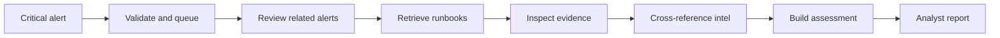

# AI Standardization Matrix

An **example of AI automation** for SIEM alert response, plus the engineering controls that example relies on.

## See the example

Interactive walkthrough (queue → MCP/RAG/intel → cited analyst report):

**https://notoriouspog.github.io/ai-standardization-matrix/**

That page is the same investigation path as the architecture lab: critical alert in, human-reviewed brief out. No live SIEM or model calls. Authored fixtures only.

## What the example shows

| Stage | What the automation does |
| --- | --- |
| Critical alert | Detection-queue arrival for a ransom-note host alert |
| Validate & queue | Schema-check the envelope and open one investigation job |
| Review related alerts | Scoped Wazuh MCP tool calls for same-host context |
| Retrieve runbooks | Tenant-approved RAG with versioned citations |
| Inspect evidence | osquery / YARA / inventory / DNS / proxy checks |
| Cross-reference intelligence | MISP + source lookups + OSV exposure (not “proven exploit”) |
| Build assessment | Structured findings, hypotheses, and owners |
| Analyst report | Reviewable brief. No auto-containment |

**Rule:** the AI gathers and drafts. A person decides.

## The controls behind that path

If you build your own agent/RAG/MCP loop, these are the bars the SIEM example is designed against. Details in [MATRIX.md](MATRIX.md), [CHECKLIST.md](CHECKLIST.md), and [data/matrix.json](data/matrix.json).

| ID | Domain | One-line rule |
| --- | --- | --- |
| C01 | Ingress & schema | Validate untrusted input before the model sees it |
| C02 | Scope & tenancy | Bind work to tenant, time, and entity scope |
| C03 | Auth & identity | Authority comes from the session, never model text |
| C04 | Tool contracts | Allowlisted tools with validated args/results |
| C05 | Retrieval & RAG | Cite only what this run retrieved |
| C06 | Evidence integrity | Findings reference known IDs only |
| C07 | Reasoning hygiene | Separate facts, hypotheses, and gaps |
| C08 | Agent bounds | Cap turns, tools, and wall time |
| C09 | Human control | Draft first; high-impact acts need a person |
| C10 | Memory | Explicit save only; labeled untrusted |
| C11 | Secrets & data | No provider keys in repo or client storage |
| C12 | Evaluation & honesty | Test citations/tools; label fixtures vs production |

Maturity is L0–L3. For a live model→tool loop, treat **L2** as the floor on C01–C08 and C11 before you call it production-ready.

## License

MIT.
